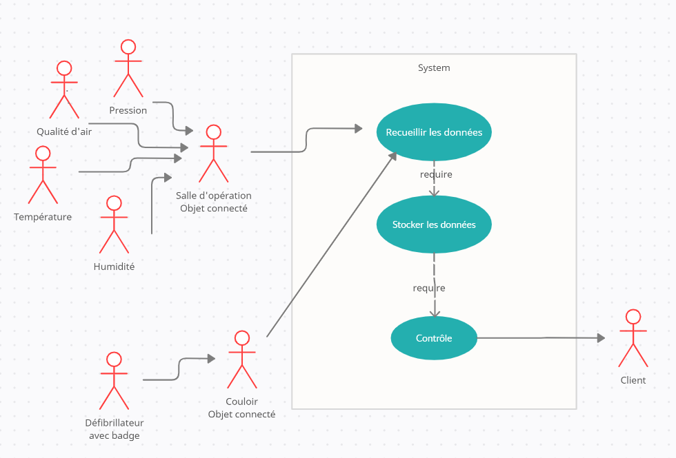

## IOT

### Diagram

### NECESSARY TOOLS AND MACHINES

- Arduino Mega <https://store.arduino.cc/products/arduino-mega-2560-rev3>
- breadboard <https://en.wikipedia.org/wiki/Breadboard>
- ESP-01 <https://www.amazon.fr/AZDelivery-ESP8266-Arduino-Raspberry-microcontr%C3%B4leur/dp/B074RL7YR3/ref=sr_1_5?keywords=esp01&qid=1649410912&sr=8-5>
- LCD 1602 <https://www.ebay.fr/itm/255475135978?hash=item3b7b8135ea:g:VKsAAOSwv45gbemv>
- Potentiometer <https://en.wikipedia.org/wiki/Potentiometer#:~:text=A%20potentiometer%20is%20a%20three,a%20variable%20resistor%20or%20rheostat.>
- Led RGB <https://www.robot-maker.com/shop/composants/294-led-rgb-5mm-294.html>
- RC522 <https://www.gotronic.fr/art-module-rfid-13-56-mhz-tag-rc522-25651.htm>
- DHT11 <https://www.robotshop.com/eu/fr/humidite-capteur-temperature-dht11.html>
- BMP180 <https://cablematic.com/fr/produits/capteur-de-pression-et-de-temperature-electronique-bmp180-gy-68-AJ015/?cr=EUR&ct=FR>
- MQ135 <https://www.gotronic.fr/art-capteur-de-gaz-mq135-31496.htm>
- Buzzer <https://euro-makers.com/fr/accessoires-arduino/3799-ard-buz5v.html?utm_campaign=google-merchant&utm_source=google-merchant-module&utm_medium=>

### APPS AND ONLINE SERVICES

- Arduino IDE <https://www.arduino.cc/en/software>

### SCHEMATICS

#### Salle d'opération

#### Localisation

